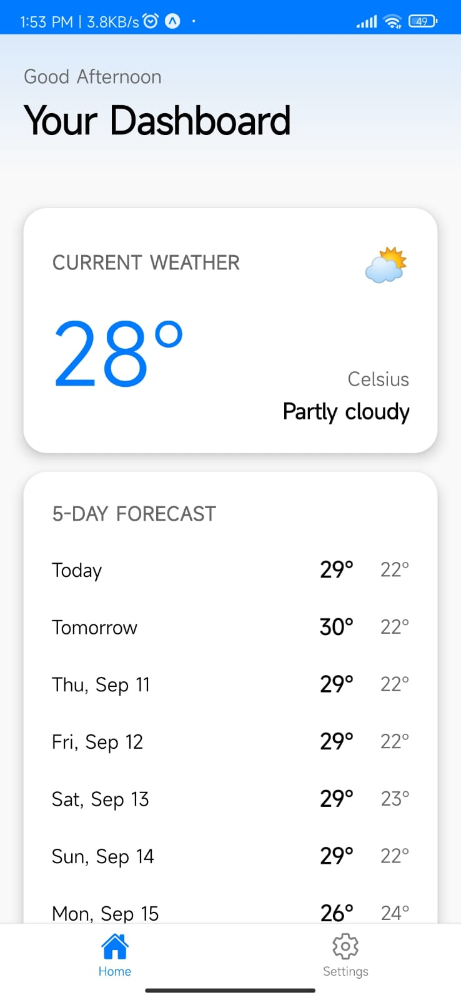
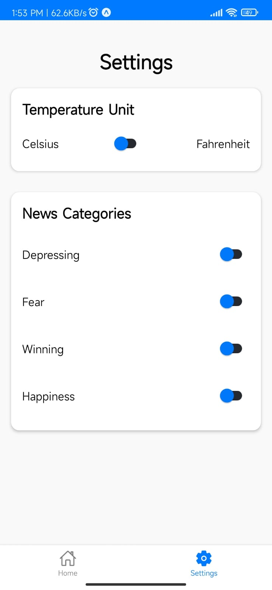

# Weather & News Aggregator App

A modern, iOS-inspired React Native app built with Expo and TypeScript that fetches and displays current weather information and news headlines. The app features unique weather-based news filtering logic and customizable user settings.

---

## Features

- **Weather Information**
  - Fetches current weather and 5-day forecast based on user location using the [Open-Meteo API](https://open-meteo.com/en/docs).
  - Displays temperature, weather conditions, and forecast with support for Celsius and Fahrenheit units.

- **News Headlines**
  - Fetches latest news headlines using [NewsAPI.ai](https://newsapi.ai/).
  - Displays headlines, brief descriptions, and links to full articles.

- **Weather-Based News Filtering**
  - Filters news based on current temperature:
    - Cold (≤ 10°C): Shows depressing news.
    - Hot (≥ 25°C): Shows news related to fear.
    - Cool (between 10°C and 25°C): Shows news about winning and happiness.

- **Settings**
  - Allows users to select preferred temperature units (Celsius/Fahrenheit).
  - Enables selection of news categories of interest.

- **Responsive & Modern UI**
  - iOS-inspired design with smooth navigation and vector icons.
  - Pull-to-refresh support on the home screen.

---

## Screenshots


### Home Screen
<p align="center">
  
  
</p>

### Settings Screen
<p align="center">
  
</p>

---

## Getting Started

### Prerequisites

- [Node.js](https://nodejs.org/) (v14 or later recommended)  
- [Expo CLI](https://docs.expo.dev/get-started/installation/)  
- A device or emulator/simulator to run the app  

### Installation

1. Clone the repository:

   ```bash
   git clone https://github.com/yourusername/weather-news-app.git
   cd weather-news-app
   ```

2. Install dependencies:

   ```bash
   npm install
   ```

3. Obtain API keys:
   - Sign up at NewsAPI.ai and get your API key.  
   - No API key needed for Open-Meteo.  

4. Configure API key:
   - Open `src/api/newsApi.ts`  
   - Replace `'YOUR_NEWSAPI_AI_KEY'` with your actual NewsAPI.ai key.  

### Running the App

Start the Expo development server:

```bash
expo start
```

- Use the Expo Go app on iOS/Android or an emulator to run the app.  
- The app will request location permission on launch to fetch weather data.  

---

## Project Structure

```
WeatherNewsApp/
│
├── src/
│   ├── api/               # API calls for weather and news
│   ├── components/        # Reusable UI components
│   ├── context/           # React Context for global state management
│   ├── navigation/        # Navigation setup
│   ├── screens/           # App screens (Home, Settings)
│   ├── theme/             # Colors and styling constants
│   └── utils/             # Helper functions
│
├── App.tsx                # Entry point
├── package.json
└── tsconfig.json
```

---

## Technologies Used

- React Native with Expo  
- TypeScript  
- React Navigation (Bottom Tabs)  
- Expo Location for geolocation  
- Axios for API requests  
- Open-Meteo API (weather)  
- NewsAPI.ai (news)  
- Expo Vector Icons for icons  

---

## Customization

- Modify news categories or filtering logic in `src/utils/helpers.ts`.  
- Adjust UI colors in `src/theme/colors.ts`.  
- Extend settings or add new features by updating context and screens.  

---

## Troubleshooting

- **Location permission denied:** Enable location in device settings.  
- **API errors:** Check NewsAPI.ai key validity and quota.  
- **Network issues:** Ensure internet connection.  

---

## License

This project is open source and available under the MIT License.

---

## Contact

For questions or feedback, please contact:

**Your Name** – your.email@example.com  
GitHub: [yourusername](https://github.com/yourusername)
